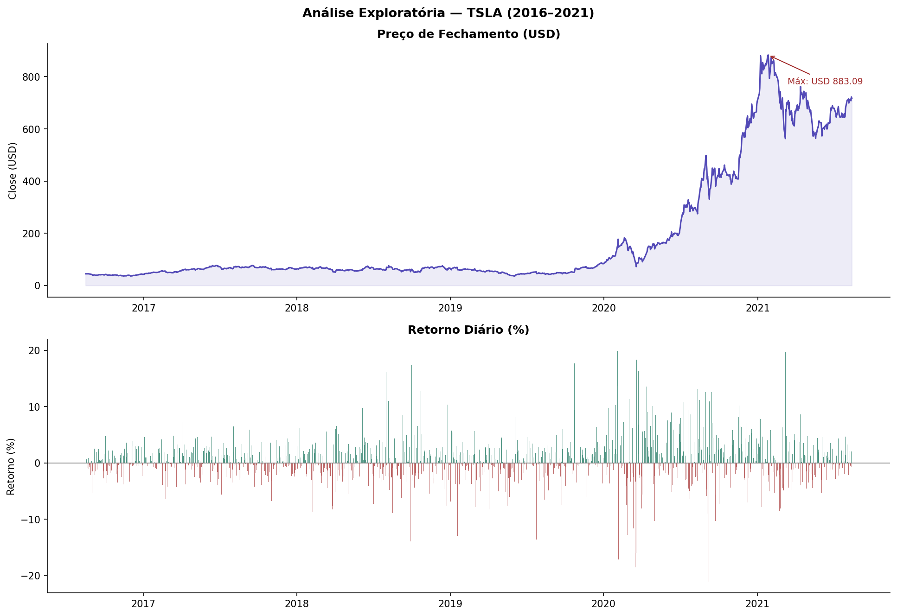
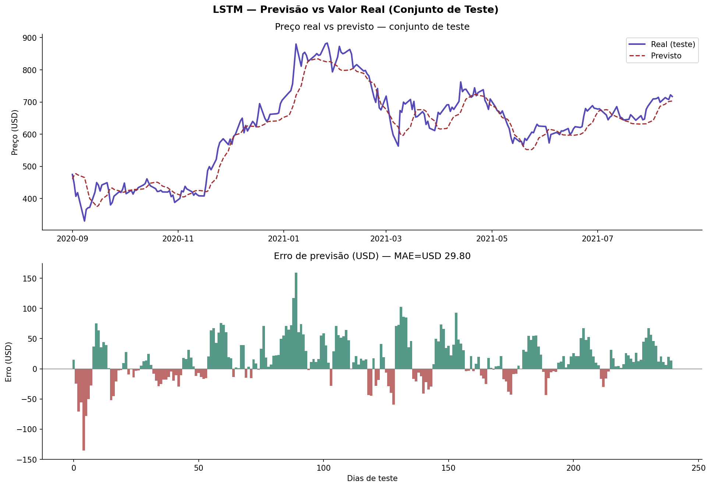
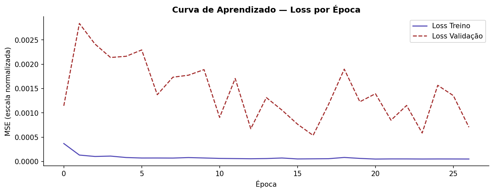
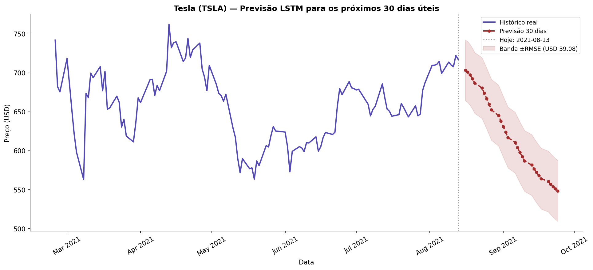

# 🚗 Previsão de Preço das Ações da Tesla com LSTM


## 📌 Introdução

Projeto de previsão de séries temporais financeiras utilizando **LSTM (Long Short-Term Memory)**, seguindo a **Metodologia Fundamental da IBM para Ciência de Dados (FMDs)** em 10 etapas.

O modelo prevê o preço de fechamento das ações da Tesla (TSLA) para os próximos 30 dias úteis, treinado com dados históricos de 2016 a 2021 (1.258 dias úteis).

## 🔑 Resultados principais

| Métrica | Valor | Interpretação |
|---|---|---|
| **MAE** | USD 29.80 | Erro médio absoluto na escala real |
| **RMSE** | USD 39.08 | Raiz do erro quadrático médio |
| **MAPE** | **4.94%** | Erro percentual médio |
| **R²** | 0.9141 | 91.4% da variância explicada pelo modelo |
| **Meta (MAPE < 10%)** | **✓ ATINGIDA** | Margem de 5pp acima da meta |
| **Épocas de treino** | 27 | EarlyStopping ativado (patience=10) |

## 📈 Previsão — Próximos 30 dias úteis

A partir do último dado disponível (USD 717.17 em 13/08/2021):

| Dia | Data | Previsão (USD) |
|---|---|---|
| +1 | 2021-08-16 | 703.24 |
| +5 | 2021-08-20 | 686.86 |
| +10 | 2021-08-27 | 652.48 |
| +20 | 2021-09-13 | 581.61 |
| +30 | 2021-09-24 | **548.25** |

**Variação estimada no período:** -23.55%  
> ⚠️ Previsões de longo prazo acumulam erro. Horizonte confiável: ~5 dias. Não usar como única fonte para decisões de investimento.

## 📊 Visualizações

| Série Temporal TSLA | Previsão vs Real (Teste) |
|---|---|
|  |  |

| Curva de Aprendizado | Previsão 30 Dias |
|---|---|
|  |  |

## 🧠 Metodologia IBM FMDs — 10 Etapas

```
Etapa 1  → Definição do problema (meta MAPE < 10%)
Etapa 2  → Coleta de dados (TSLA.csv — Yahoo Finance, 2016–2021)
Etapa 3  → Preparação: MinMaxScaler, janela deslizante de 60 dias
Etapa 4  → EDA: série temporal, retornos diários, correlação
Etapa 5  → Modelagem: LSTM 2 camadas + Dropout + EarlyStopping
Etapa 6  → Avaliação: MAE, RMSE, MAPE, R² no conjunto de teste
Etapa 7  → Previsão iterativa dos próximos 30 dias úteis
Etapa 8  → Monitoramento: thresholds de alerta e re-treinamento
Etapa 9  → Comunicação: sumário executivo para stakeholders
Etapa 10 → Revisão: próximos passos e melhorias identificadas
```

## 🏗️ Arquitetura do Modelo

```
Input (60 dias) → LSTM(50) → Dropout(0.2) → LSTM(50) → Dropout(0.2) → Dense(1)

Optimizer  : Adam
Loss       : MSE
Épocas     : 27 (EarlyStopping patience=10)
Batch size : 32
Split      : 80% treino (958 amostras) / 20% teste (240 amostras)
Divisão    : temporal — sem data leakage
```

## ⚠️ Limitações

- Previsões de longo prazo acumulam erro — horizonte confiável de ~5 dias
- Não incorpora eventos macroeconômicos, notícias ou sentimento de mercado
- Assume que padrões históricos se repetem — inválido em regimes de alta volatilidade
- **Não deve ser usado como única fonte para decisões de investimento**

## 🛠️ Stack

- **Modelagem:** TensorFlow/Keras, scikit-learn
- **Análise:** pandas, NumPy
- **Visualização:** matplotlib, seaborn
- **Ambiente:** Google Colab / Jupyter

## ▶️ Como executar

```bash
pip install tensorflow pandas numpy matplotlib seaborn scikit-learn
```

1. Faça upload do `TSLA.csv` no Colab
2. Execute o notebook: `notebooks/Tesla_LSTM_v2.ipynb`

Dataset: [TSLA Historical Data — Yahoo Finance](https://finance.yahoo.com/quote/TSLA/history/)

## 🔗 Projetos relacionados

- [Inferência Bayesiana Aplicada — A/B Testing](https://github.com/gilsonmm6/bayesian-ab-marketing)
- [Análise de Fairness — COMPAS](https://github.com/gilsonmm6/compas-fairness-analysis)
- [Teste A/B Frequentista — Campanhas de Marketing](https://github.com/gilsonmm6/ab-testing-frequentist)

## 👤 Autor

**Gilson Machado Monteiro**  
Data Analyst & BI Analyst | Especialização em Estatística Aplicada (PUC Minas)  
[LinkedIn](https://linkedin.com/in/gilsonmm6) · [GitHub](https://github.com/gilsonmm6)
